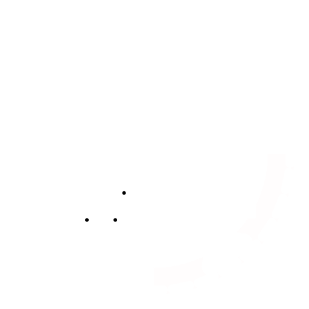

<div align="center">

</img>
<h1>The Popcorn Kernel</h1>

---

</div>

Welcome to the Popcorn Kernel project! Our mission is to learn more about operating systems and expand our coding and developing skills.

<div align="center">

<br/>
<p align="center">
	<a href="https://github.com/popcorn-kernel/popcorn/forks">
		</a>
	<a href="https://github.com/popcorn-kernel/popcorn">
		</a>
	<a href="https://github.com/popcorn-kernel/popcorn/issues">
		</a>
	<a href="https://opensource.org/license/mit/">
		</a>
    <a href="https://discord.gg/d9974fz5sS">
        </a>
</p>
</div>

## About PURE Ecosystem
The PURE Ecosystem is an open-source community dedicated to developing alternatives and having fun! The PURE Ecosystem embraces values of equality, respect, and tolerance, supporting all individuals regardless of their gender identity, race, or background.

## Project Goals
- Innovation: The Popcorn Kernel will be a new and fresh cut on the operating system side.

- Efficiency: We want to create a highly optimized kernel that aims maximizes system performance.

- Accessibility: The Popcorn Kernel will be designed to ensure inclusivity and provide a seamless experience for all users, regardless of their abilities.

## Features
- Customizability: Popcorn Kernel offers extensive customization options, allowing users to personalize their computing environment according to their preferences.

- Security: We prioritize user safety and data protection by implementing robust security measures within the kernel.

- Compatibility: Popcorn Kernel aims to support a wide range of hardware configurations and software applications to ensure compatibility across different systems.

## Contributing

We welcome contributions from developers, designers, and enthusiasts who share our vision for an inclusive and powerful kernel. To contribute to the Popcorn Kernel project, please Read our [guide.](https://github.com/popcorn-kernel/popcorn/blob/main/CONTRIBUTING.md)

## Getting Started
### Prerequisites
- Rust/Cargo
- QEMU

### Building and Running
Before building the kernel, you must first install the required dependencies. To install the dependencies, run the following command:
```./scripts/configure.sh```

To build the kernel, run the following command:
```cargo bootimage```

To run the kernel in QEMU, run the following command:
```cargo run```

---

<div style="width: 75%; margin: 0 auto;">
    <div align="center">

## Developers


  |  |  |  |  |   |  | |
  |:---:|:---:|:---:|:---:|:---:|:---:|:---:|
  | [SparkySimp](https://github.com/SparkySimp) | [electron271](https://github.com/electron271) | [SatoTsukasaCode](https://github.com/SatoTsukasaCode) | [Techiesplash](https://github.com/Techiesplash) | [HackedOS](https://github.com/HackedOS)| [TadoTheMiner](https://github.com/TadoTheMiner) | [Lily8000](https://github.com/Lily8000) |
  | Lead Developer | Lead Developer | Developer | Developer | Developer | Developer | Documentation |
</div>
</div>

<div align="center">

## Contact us
 [Discord](https://discord.gg/d9974fz5sS)
 [Website](https://popcorn-kernel.dev/) 
</div>
